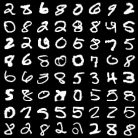
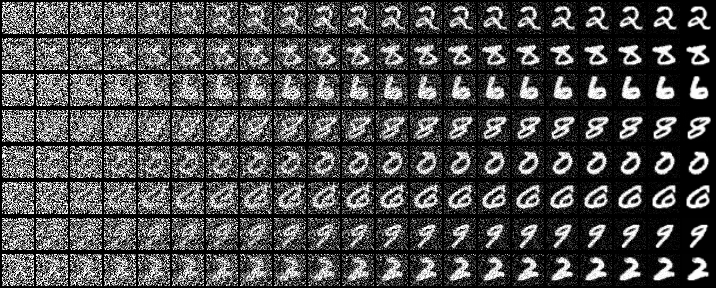
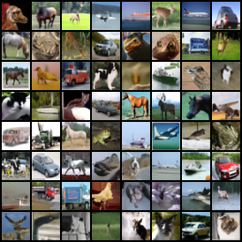
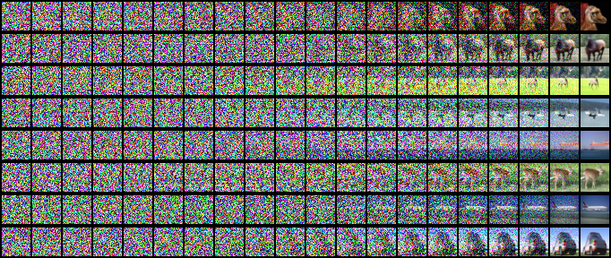
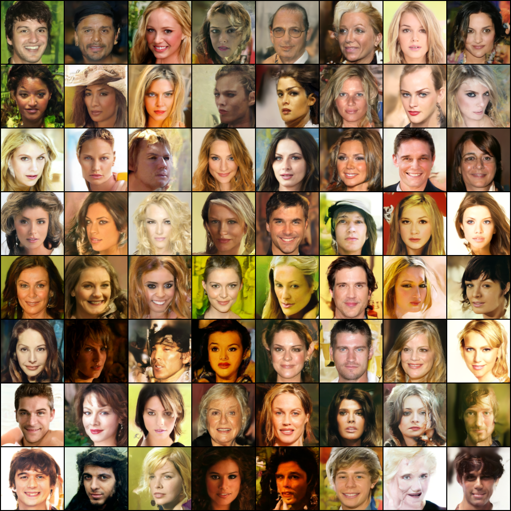

# Repro-Diffusion-Models

Reproduce Diffusion Models with PyTorch.

## Progress

- [x] DDPM
- [x] DDIM

 

## DDPM [[doc](./docs/DDPM.md)]

**Quantitative results on CIFAR-10 32x32**:

<table align="center" width=100%>
  <tr>
    <th align="center">Type of variance</th>
    <th align="center">timesteps</th>
    <th align="center">FID</th>
    <th align="center">IS</th>
  </tr>
  <tr>
    <td align="center">fixed-large</td>
    <td align="center">1000</td>
    <td align="center"><b>3.1246</b></td>
    <td align="center"><b>9.3690 (0.1015)</b></td>
  </tr>
  <tr>
    <td align="center" rowspan="4">fixed-small</td>
    <td align="center">1000</td>
    <td align="center">5.3026</td>
    <td align="center">8.9711 (0.1172)</td>
  </tr>
  <tr>
    <td align="center">100 (10x faster)</td>
    <td align="center">11.1331</td>
    <td align="center">8.5436 (0.1291)</td>
  </tr>
  <tr>
    <td align="center">50 (20x faster)</td>
    <td align="center">15.5682</td>
    <td align="center">8.3658 (0.0665)</td>
  </tr>
  <tr>
    <td align="center">10 (100x faster)</td>
    <td align="center">40.8977</td>
    <td align="center"> 7.1148 (0.0824)</td>
  </tr>
 </table>

**Qualitative results**:

<table align="center" width=100%>
  <tr>
    <th align="center" width=10%>Dataset</th>
    <th align="center" width=27%>Random samples</th>
    <th align="center" width=63%>Denoising process</th>
  </tr>
  <tr>
    <th align="center">MNIST 32x32</th>
    <td align="center"></td>
    <td align="center"></td>
  </tr>
  <tr>
    <th align="center">CIFAR-10 32x32</th>
    <td align="center"></td>
    <td align="center"></td>
  </tr>
  <tr>
    <th align="center">CelebA-HQ 256x256</th>
    <td align="center"></td>
    <td align="center"></td>
  </tr>
 </table>

:warning: Results on CelebA-HQ 256x256 suffer from severe color shifting problem, and I currently have no clue about it.

 

## DDIM [[doc](./docs/DDIM.md)]

**Quantitative results on CIFAR-10 32x32**:

<table align="center" width=100%>
  <tr>
    <th align="center">eta</th>
    <th align="center">timesteps</th>
    <th align="center">FID</th>
    <th align="center">IS</th>
  </tr>
  <tr>
    <td align="center" rowspan="4">0.0</td>
    <td align="center">1000</td>
    <td align="center">4.2221</td>
    <td align="center">9.0388 (0.0994)</td>
  </tr>
  <tr>
    <td align="center">100 (10x faster)</td>
    <td align="center">6.0774</td>
    <td align="center">8.7873 (0.1186)</td>
  </tr>
  <tr>
    <td align="center">50 (20x faster)</td>
    <td align="center">7.7867</td>
    <td align="center">8.6770 (0.1304)</td>
  </tr>
  <tr>
    <td align="center">10 (100x faster)</td>
    <td align="center">18.9220</td>
    <td align="center">8.0326 (0.0961)</td>
  </tr>
  <tr>
    <td align="center" rowspan="4">1.0</td>
    <td align="center">1000</td>
    <td align="center">5.2496</td>
    <td align="center">8.8996 (0.1010)</td>
  </tr>
  <tr>
    <td align="center">100 (10x faster)</td>
    <td align="center">11.1593</td>
    <td align="center">8.5983 (0.1114)</td>
  </tr>
  <tr>
    <td align="center">50 (20x faster)</td>
    <td align="center">15.2403</td>
    <td align="center">8.3222 (0.1139)</td>
  </tr>
  <tr>
    <td align="center">10 (100x faster)</td>
    <td align="center">40.6563</td>
    <td align="center">7.1315 (0.0682)</td>
  </tr>
 </table>

**Qualitative results**:

- Sample with fewer steps:

  

    
  

  It can be seen that fewer steps leads to blurrier results.

- Spherical linear interpolation (slerp) between two samples (100 steps):

  

    
  

  
  

    
  

