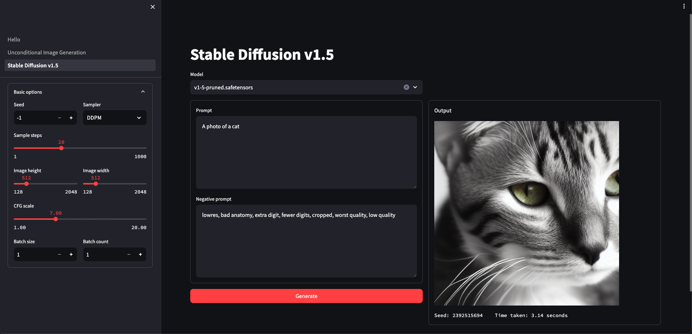

# Diffusion-Models-Implementations

Implement Diffusion Models with PyTorch.

This is a **research-oriented** repository aiming to implement and reproduce diffusion models, including:

- [x] DDPM ([paper](https://arxiv.org/abs/2006.11239) | [website](https://hojonathanho.github.io/diffusion/) | [official repo](https://github.com/hojonathanho/diffusion))
- [x] DDIM ([paper](https://arxiv.org/abs/2010.02502) | [official repo](https://github.com/ermongroup/ddim))
- [x] Classifier-Free Guidance ([paper](https://arxiv.org/abs/2207.12598))
- [x] DDPM-IP ([paper](https://arxiv.org/abs/2301.11706) | [official repo](https://github.com/forever208/ddpm-ip))
- [x] CLIP Guidance
- [x] Mask Guidance ([RePaint paper](https://arxiv.org/abs/2201.09865) | [RePaint official repo](https://github.com/andreas128/RePaint))
- [x] ILVR ([paper](https://arxiv.org/abs/2108.02938) | [official repo](https://github.com/jychoi118/ilvr_adm))
- [x] SDEdit ([paper](https://arxiv.org/abs/2108.01073) | [website](https://sde-image-editing.github.io/) | [official repo](https://github.com/ermongroup/SDEdit))
- [x] DDIB ([paper](https://arxiv.org/abs/2203.08382) | [website](https://suxuann.github.io/ddib/) | [official repo](https://github.com/suxuann/ddib))
- [x] SD1.5 / 2.1 ([official repo](https://github.com/Stability-AI/stablediffusion))

<br/>


## Installation

Clone this repo:

```shell
git clone https://github.com/xyfJASON/Diffusion-Models-Implementations.git
cd Diffusion-Models-Implementations
```

Create and activate a conda environment:

```shell
conda create -n diffusion python=3.11
conda activate diffusion
```

Install dependencies:

```shell
pip install -r requirements.txt
```

Install xformers (optional but recommended):

```shell
pip install xformers==0.0.23.post1
```

<br/>


## Documentations

For instructions on training / sampling / evaluation, please refer to the [docs](./docs) folder.

<br/>


## Pretrained weights

### Checkpoints and training logs

All the checkpoints and training logs trained by this repository are uploaded to [huggingface](https://huggingface.co/xyfJASON/Diffusion-Models-Implementations/tree/main).


### Loading models from other repositories

Training a diffusion model on a large-scale dataset from scratch is time-consuming, especially with limited devices. Thus, this repository supports loading models from other open source repositories, as listed below.

<table style="text-align: center">
    <tr>
        <th>Model Arch.</th>
        <th>Dataset</th>
        <th>Resolution</th>
        <th>Original Repo</th>
        <th>Config file</th>
    </tr>
    <tr>
        <td rowspan="2">UNet by pesser</td>
        <td>CelebA-HQ</td>
        <td>256x256</td>
        <td rowspan="2"><a href="https://github.com/pesser/pytorch_diffusion">pesser/pytorch_diffusion</a></td>
        <td><a href="./weights/pesser/pytorch_diffusion/ema_diffusion_celebahq_model-560000.yaml">config</a></td>
    </tr>
    <tr>
        <td>LSUN-Church</td>
        <td>256x256</td>
        <td><a href="./weights/pesser/pytorch_diffusion/ema_diffusion_lsun_church_model-4432000.yaml">config</a></td>
    </tr>
    <tr>
        <td rowspan="6">ADM by openai</td>
        <td>ImageNet (unconditional)</td>
        <td>256x256</td>
        <td rowspan="2"><a href="https://github.com/openai/guided-diffusion">openai/guided-diffusion</a></td>
        <td><a href="./weights/openai/guided-diffusion/256x256_diffusion_uncond.yaml">config</a></td>
    </tr>
    <tr>
        <td>ImageNet (conditional)</td>
        <td>256x256</td>
        <td><a href="./weights/openai/guided-diffusion/256x256_diffusion.yaml">config</a></td>
    </tr>
    <tr>
        <td>AFHQ-Dog</td>
        <td>256x256</td>
        <td><a href="https://github.com/jychoi118/ilvr_adm">jychoi118/ilvr_adm</a></td>
        <td><a href="./weights/jychoi118/ilvr_adm/afhqdog_p2.yaml">config</a></td>
    </tr>
    <tr>
        <td>AFHQ-Cat</td>
        <td>256x256</td>
        <td rowspan="2"><a href="https://github.com/ChenWu98/cycle-diffusion">ChenWu98/cycle-diffusion</a></td>
        <td><a href="./weights/ChenWu98/cycle-diffusion/cat_ema_0.9999_050000.yaml">config</a></td>
    </tr>
    <tr>
        <td>AFHQ-Wild</td>
        <td>256x256</td>
        <td><a href="./weights/ChenWu98/cycle-diffusion/wild_ema_0.9999_050000.yaml">config</a></td>
    </tr>
    <tr>
        <td>CelebA-HQ</td>
        <td>256x256</td>
        <td><a href="https://github.com/andreas128/RePaint">andreas128/RePaint</a></td>
        <td><a href="./weights/andreas128/RePaint/celeba256_250000.yaml">config</a></td>
    </tr>
    <tr>
        <td rowspan="2">DiT by meta</td>
        <td>ImageNet (conditional)</td>
        <td>256x256</td>
        <td rowspan="2"><a href="https://github.com/facebookresearch/DiT">facebookresearch/DiT</a></td>
        <td><a href="./weights/facebookresearch/DiT/DiT-XL-2-256x256.yaml">config</a></td>
    </tr>
    <tr>
        <td>ImageNet (conditional)</td>
        <td>512x512</td>
        <td><a href="./weights/facebookresearch/DiT/DiT-XL-2-512x512.yaml">config</a></td>
    </tr>
    <tr>
        <td>MDT</td>
        <td>ImageNet (conditional)</td>
        <td>256x256</td>
        <td><a href="https://github.com/sail-sg/MDT">sail-sg/MDT</a></td>
        <td><a href="./weights/sail-sg/MDT/mdt_xl2_v2_ckpt.yaml">config</a></td>
    </tr>
    <tr>
        <td rowspan="2">Stable Diffusion (v1.5 / v2.1)</td>
        <td>LAION</td>
        <td>512x512</td>
        <td><a href="https://github.com/runwayml/stable-diffusion">runwayml/stable-diffusion</a></td>
        <td><a href="./weights/stablediffusion/v1-inference.yaml">config</a></td>
    </tr>
    <tr>
        <td>LAION</td>
        <td>768x768</td>
        <td><a href="https://github.com/Stability-AI/stablediffusion">Stability-AI/stablediffusion</a></td>
        <td><a href="./weights/stablediffusion/v2-inference-v.yaml">config</a></td>
    </tr>
    <tr>
        <td >Stable Diffusion XL</td>
        <td>LAION</td>
        <td>1024x1024</td>
        <td><a href="https://github.com/Stability-AI/generative-models">Stability-AI/generative-models</a></td>
        <td><a href="./weights/sdxl/sd_xl_base.yaml">config</a></td>
    </tr>
</table>

The configuration files are located at `./weights/<github username>/<repo name>/<weights filename>.yaml`, so it should be easy to find the corresponding model weights.
Please put the downloaded weights next to the configuration files. For example:

```text
weights
├── pesser
│   └── pytorch_diffusion
│       ├── ema_diffusion_celebahq_model-560000.pt
│       └── ema_diffusion_celebahq_model-560000.yaml
├── openai
│   └── guided-diffusion
│       ├── 256x256_diffusion_uncond.pt
│       ├── 256x256_diffusion_uncond.yaml
│       ├── 256x256_diffusion.pt
│       └── 256x256_diffusion.yaml
└── ...
```

<br/>


## Streamlit WebUI

Besides the command-line interface, this repo also provides a WebUI based on [Streamlit](https://streamlit.io/) library for easy interaction with the implemented models and algorithms. To run the WebUI, execute the following command:

```shell
streamlit run streamlit/Hello.py
```

<p align="center">
  
</p>

<br/>


## Preview

This section provides previews of the results generated by the implemented models and algorithms.

For more comprehensive quantitative and qualitative results, please refer to the documentations in the [docs](./docs) folder.


### DDPM

<p align="center">
  
  
  
</p>


### DDIM

<p align="center">
  
  
</p>


### Classifier-Free Guidance

<p align="center">
  
</p>


### CLIP Guidance

<p align="center">
  
</p>


### Mask Guidance

<p align="center">
  
</p>


### ILVR

<p align="center">
  
</p>


### SDEdit

<p align="center">
  
</p>


### DDIB

<p align="center">
  
</p>
