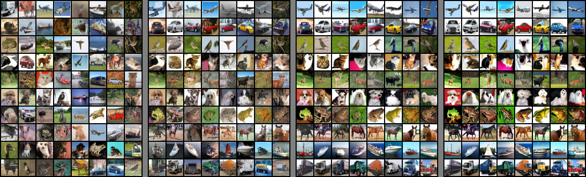
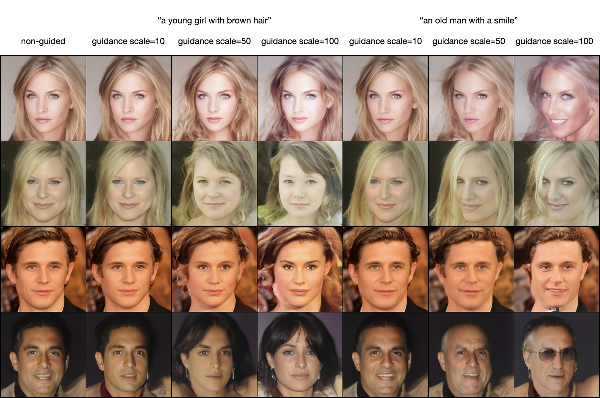
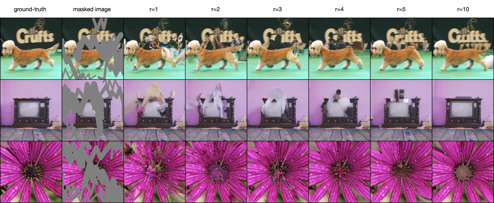
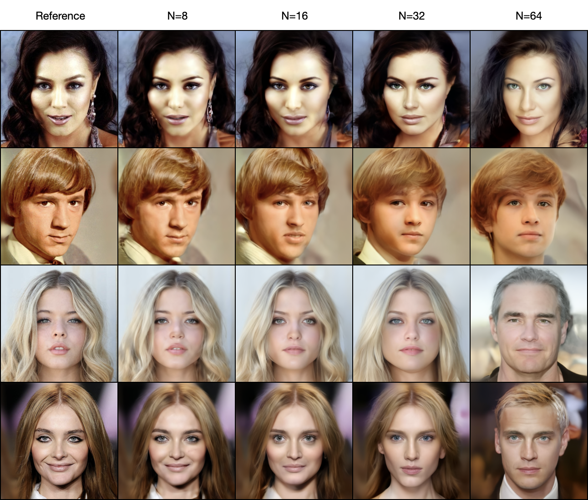
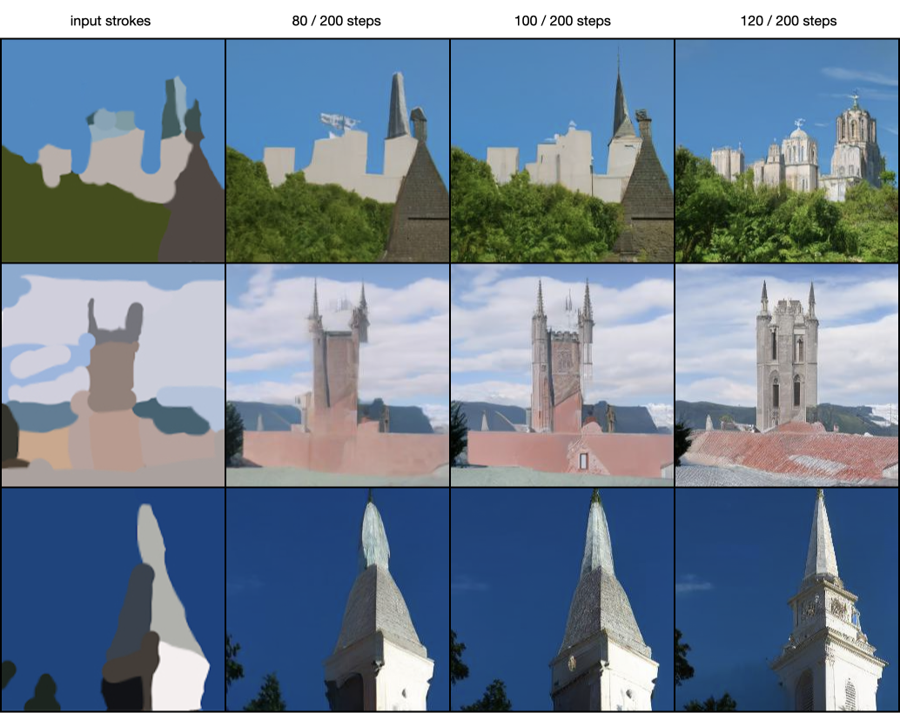
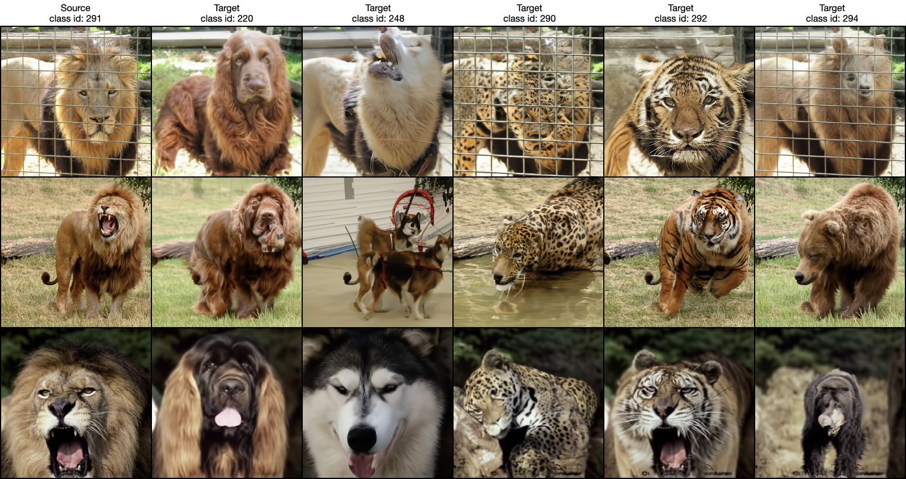
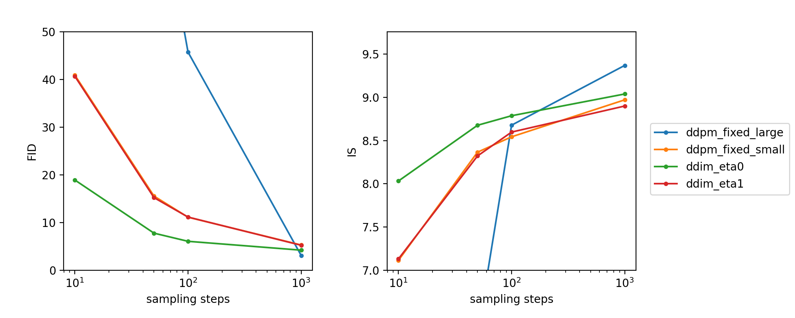

# Diffusion-Models-Implementations

Implement Diffusion Models with PyTorch.


## Progress

- [x] DDPM
- [x] DDIM
- [x] Classifier-Free Guidance
- [x] DDPM-IP
- [x] CLIP Guidance
- [x] Mask Guidance
- [x] ILVR
- [x] SDEdit
- [x] DDIB

<br/>


## Getting Started

### Environment

```shell
conda create -n diffusion python=3.11
conda activate diffusion
pip install -r requirements.txt
```


### Documentations

For instructions on training / sampling / evaluation, please refer to the [docs](./docs) folder.


### Pretrained weights

All the checkpoints and training logs are stored in [xyfJASON/Diffusion-Models-Implementations](https://huggingface.co/xyfJASON/Diffusion-Models-Implementations/tree/main) on huggingface.


### Loading models and weights from other repositories

Training a diffusion model on a large-scale dataset from scratch is time-consuming, especially with limited devices. Thus, this repository supports loading models and weights from other open source repositories, as listed below.

<table style="text-align: center">
    <tr>
        <th>Model Arch.</th>
        <th>Dataset</th>
        <th>Resolution</th>
        <th>Original Repo</th>
        <th>Config file</th>
    </tr>
    <tr>
        <td rowspan="2">UNet by pesser</td>
        <td>CelebA-HQ</td>
        <td>256x256</td>
        <td><a href="https://github.com/pesser/pytorch_diffusion">pesser/pytorch_diffusion</a></td>
        <td><a href="./configs/pesser/pytorch_diffusion/ema_diffusion_celebahq_model-560000.yaml">config</a></td>
    </tr>
    <tr>
        <td>LSUN-Church</td>
        <td>256x256</td>
        <td><a href="https://github.com/pesser/pytorch_diffusion">pesser/pytorch_diffusion</a></td>
        <td><a href="./configs/pesser/pytorch_diffusion/ema_diffusion_lsun_church_model-4432000.yaml">config</a></td>
    </tr>
    <tr>
        <td rowspan="4">ADM by openai</td>
        <td>ImageNet (unconditional)</td>
        <td>256x256</td>
        <td><a href="https://github.com/openai/guided-diffusion">openai/guided-diffusion</a></td>
        <td><a href="./configs/openai/guided-diffusion/256x256_diffusion_uncond.yaml">config</a></td>
    </tr>
    <tr>
        <td>ImageNet (conditional)</td>
        <td>256x256</td>
        <td><a href="https://github.com/openai/guided-diffusion">openai/guided-diffusion</a></td>
        <td><a href="./configs/openai/guided-diffusion/256x256_diffusion.yaml">config</a></td>
    </tr>
    <tr>
        <td>AFHQ-Dog</td>
        <td>256x256</td>
        <td><a href="https://github.com/jychoi118/ilvr_adm">jychoi118/ilvr_adm</a></td>
        <td><a href="./configs/jychoi118/ilvr_adm/afhqdog_p2.yaml">config</a></td>
    </tr>
    <tr>
        <td>CelebA-HQ</td>
        <td>256x256</td>
        <td><a href="https://github.com/andreas128/RePaint">andreas128/RePaint</a></td>
        <td><a href="./configs/andreas128/RePaint/celebahq_256_250000.yaml">config</a></td>
    </tr>
</table>

The configuration files are located at `./configs/<github username>/<repo name>/<weights filename>.yaml`, so it should be easy to find the corresponding weights.

<br/>


## Preview

This section provides a preview of the results achieved by the implemented methods and algorithms. For more comprehensive quantitative and qualitative results, please refer to the documentations in the [docs](./docs) folder.


### DDPM

[paper](https://arxiv.org/abs/2006.11239) | [website](https://hojonathanho.github.io/diffusion/) | [official repo](https://github.com/hojonathanho/diffusion)

<p align="center">
  
  
  
</p>


### DDIM

[paper](https://arxiv.org/abs/2010.02502) | [official repo](https://github.com/ermongroup/ddim)

<p align="center">
  
  
</p>


### Classifier-Free Guidance

[paper](https://arxiv.org/abs/2207.12598)

<p align="center">
  
</p>


### CLIP Guidance

<p align="center">
  
</p>


### Mask Guidance

[RePaint paper](https://arxiv.org/abs/2201.09865) | [RePaint official repo](https://github.com/andreas128/RePaint)

<p align="center">
  
</p>


### ILVR

[paper](https://arxiv.org/abs/2108.02938) | [official repo](https://github.com/jychoi118/ilvr_adm)

<p align="center">
  
</p>


### SDEdit

[paper](https://arxiv.org/abs/2108.01073) | [website](https://sde-image-editing.github.io/) | [official repo](https://github.com/ermongroup/SDEdit)

<p align="center">
  
</p>


### DDIB

[paper](https://arxiv.org/abs/2203.08382) | [website](https://suxuann.github.io/ddib/) | [official repo](https://github.com/suxuann/ddib)

<p align="center">
  
</p>

<br/>


## Sampling Algorithms: Fidelity-Speed Visualization

I use the same model in all tests, which is trained following the standard DDPM. Thus the comparison depends only on the performance of different sampling algorithms (or SDE/ODE solvers).

<p align="center">
  
</p>

Notes:

- DDPM (fixed-small) is equivalent to DDIM(η=1).
- DDPM (fixed-large) performs better than DDPM (fixed-small) with 1000 steps, but degrades drastically as the number of steps decreases. If you check on the samples from DDPM (fixed-large) (<= 100 steps), you'll find that they still contain noticeable noises.

