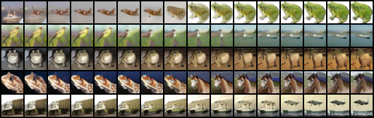
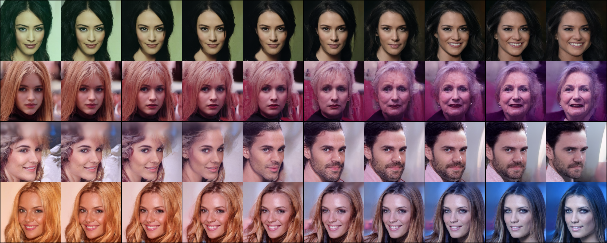
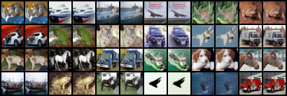
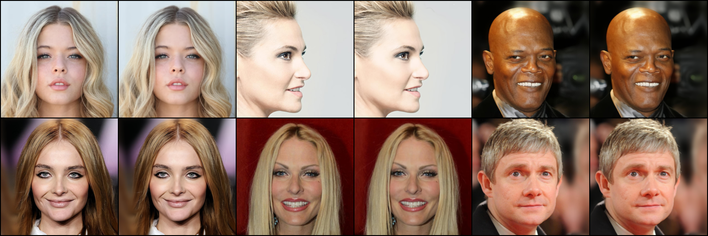

# DDIM

> Song, Jiaming, Chenlin Meng, and Stefano Ermon. "Denoising Diffusion Implicit Models." In *International Conference on Learning Representations*. 2020.


## Training

DDIM shares the same training process with DDPM. Please refer to [DDPM doc](./DDPM.md).


## Sampling

```shell
accelerate-launch sample_ddim.py -c CONFIG \
                                 --weights WEIGHTS \
                                 --n_samples N_SAMPLES \
                                 --save_dir SAVE_DIR \
                                 [--seed SEED] \
                                 [--load_ema LOAD_EMA] \
                                 [--ddim_eta DDIM_ETA] \
                                 [--skip_type SKIP_TYPE] \
                                 [--skip_steps SKIP_STEPS] \
                                 [--micro_batch MICRO_BATCH] \
                                 [--mode {sample,interpolate,reconstruction}] \
                                 [--n_interpolate N_INTERPOLATE] \
                                 [--input_dir INPUT_DIR]
```

- This repo uses the [🤗 Accelerate](https://huggingface.co/docs/accelerate/index) library for multi-GPUs/fp16 supports. Please read the [documentation](https://huggingface.co/docs/accelerate/basic_tutorials/launch#using-accelerate-launch) on how to launch the scripts on different platforms.
- Use `--skip_steps SKIP_STEPS` for faster sampling that skip timesteps.
- Choose a sampling mode by `--mode MODE`, the options are:
  - `sample` (default): randomly sample images
  - `interpolate`: sample two random images and interpolate between them. Use `--n_interpolate` to specify the number of images in between.
  - `reconstruction`:  encode a real image from dataset with **DDIM inversion** (DDIM encoding), and then decode it with DDIM sampling.
- Specify `--micro_batch MICRO_BATCH` to sample images batch by batch. Set it as large as possible to fully utilize your devices.


## Evaluation

Sample 10K-50K images following the previous section and evaluate image quality with tools like [torch-fidelity](https://github.com/toshas/torch-fidelity), [pytorch-fid](https://github.com/mseitzer/pytorch-fid), [clean-fid](https://github.com/GaParmar/clean-fid), etc.


## Results

**FID and IS on CIFAR-10 32x32**:

All the metrics are evaluated on 50K samples using [torch-fidelity](https://torch-fidelity.readthedocs.io/en/latest/index.html) library.

<table align="center" width=100%>
  <tr>
    <th align="center">eta</th>
    <th align="center">timesteps</th>
    <th align="center">FID ↓</th>
    <th align="center">IS ↑</th>
  </tr>
  <tr>
    <td align="center" rowspan="4">0.0</td>
    <td align="center">1000</td>
    <td align="center">4.1892</td>
    <td align="center">9.0626 ± 0.1093</td>
  </tr>
  <tr>
    <td align="center">100 (10x faster)</td>
    <td align="center">6.0508</td>
    <td align="center">8.8424 ± 0.0862</td>
  </tr>
  <tr>
    <td align="center">50 (20x faster)</td>
    <td align="center">7.7011</td>
    <td align="center">8.7076 ± 0.1021</td>
  </tr>
  <tr>
    <td align="center">10 (100x faster)</td>
    <td align="center">18.9559</td>
    <td align="center">8.0852 ± 0.1137</td>
  </tr>
 </table>


**Sample with fewer steps**:

<p align="center">
  
</p>

From top to bottom: 10 steps, 50 steps, 100 steps and 1000 steps. It can be seen that fewer steps leads to blurrier results, but human eyes can hardly distinguish the difference between 50/100 steps and 1000 steps.


**Spherical linear interpolation (slerp) between two samples (sample with 100 steps)**:

<p align="center">
  
</p>

<p align="center">
  
</p>


**Reconstruction (sample with 100 steps)**:

<p align="center">
  
</p>


In each pair, image on the left is the real image sampled from dataset, the other is the reconstructed image generated by DDIM inversion + DDIM sampling.


**Reconstruction (sample with 1000 steps)**:

<p align="center">
  
</p>
