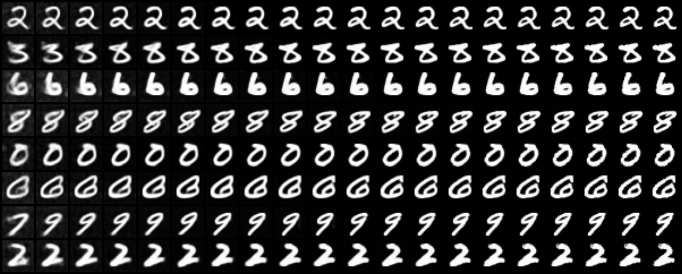

# DDPM

> Ho, Jonathan, Ajay Jain, and Pieter Abbeel. "Denoising diffusion probabilistic models." *Advances in Neural Information Processing Systems* 33 (2020): 6840-6851.


## Training

```shell
python train_ddpm.py -c FILE -n NAME [--opts KEY1 VALUE1 KEY2 VALUE2 ...]
```

- To train on multiple GPUs, replace `python` with `torchrun --nproc_per_node NUM_GPUS`.
- An experiment directory will be created under `./runs/` for each run, which is named after `NAME`, or the current time if `NAME` is not specified. The directory contains logs, checkpoints, tensorboard, etc.

For example, to train on CIFAR-10:

```shell
python train_ddpm.py -c ./configs/ddpm_cifar10.yaml
```


## Sampling

```shell
python sample_ddpm.py -c FILE \
                      --model_path MODEL_PATH \
                      [--load_ema] \
                      [--respace RESPACE] \
                      --n_samples N_SAMPLES \
                      --save_dir SAVE_DIR \
                      [--batch_size BATCH_SIZE] \
                      [--seed SEED] \
                      [--mode MODE] \
                      [--n_denoise N_DENOISE] \
                      [--n_progressive N_PROGRESSIVE] \
                      [--opts KEY1 VALUE1 KEY2 VALUE2 ...]
```

- To sample on multiple GPUs, replace `python` with `torchrun --nproc_per_node NUM_GPUS`.
- Use `--respace RESPACE` for faster sampling that skip timesteps. 
- Choose a sampling mode by `--mode MODE`, the options are:
  - `sample` (default): randomly sample images
  - `denoise`: sample images with visualization of its denoising process. Use `--n_denoise` to specify the number of images in visualization.
  - `progressive`:  sample images with visualization of its progressive generation process. Use `--n_progressive` to specify the number of images in visualization.
- Specify `--batch_size BATCH_SIZE` to sample images batch by batch. Set it as large as possible to fully utilize your devices. The default value of 1 is pretty slow.


## Evaluation

First, sample 10k~50k images following previous section. Then, run:

```shell
python evaluate.py --img_size IMG_SIZE \
                   --n_eval N_EVAL \
                   [--batch_size BATCH_SIZE] \
                   --real_dir REAL_DIR \
                   --fake_dir FAKE_DIR
```

- To evaluate on multiple GPUs, replace `python` with `torchrun --nproc_per_node NUM_GPUS`.
- The number of images for evaluation will be adjusted to `min(n_eval, len(real_images), len(fake_images))`.
- Specify `--batch_size BATCH_SIZE` to evaluate images batch by batch. Set it as large as possible to fully utilize your devices. The default value of 1 is pretty slow.


## Results

:warning: Generated CelebA-HQ 256x256 images suffer from severe color shifting problem, and I currently have no clue about it.


**FID and IS on CIFAR-10 32x32**:

All the metrics are evaluated on 50K samples.

<table align="center" width=100%>
  <tr>
    <th align="center">Type of variance</th>
    <th align="center">timesteps</th>
    <th align="center">FID ↓</th>
    <th align="center">IS ↑</th>
  </tr>
  <tr>
    <td align="center" rowspan="4">fixed-large</td>
    <td align="center">1000</td>
    <td align="center"><b>3.1246</b></td>
    <td align="center"><b>9.3690 (0.1015)</b></td>
  </tr>
  <tr>
    <td align="center">100 (10x faster)</td>
    <td align="center">45.7398</td>
    <td align="center">8.6780 (0.1260)</td>
  </tr>
  <tr>
    <td align="center">50 (20x faster)</td>
    <td align="center">85.2383</td>
    <td align="center">6.2571 (0.0939)</td>
  </tr>
  <tr>
    <td align="center">10 (100x faster)</td>
    <td align="center">267.5894</td>
    <td align="center">1.5900 (0.0082)</td>
  </tr>
  <tr>
    <td align="center" rowspan="4">fixed-small</td>
    <td align="center">1000</td>
    <td align="center">5.3026</td>
    <td align="center">8.9711 (0.1172)</td>
  </tr>
  <tr>
    <td align="center">100 (10x faster)</td>
    <td align="center">11.1331</td>
    <td align="center">8.5436 (0.1291)</td>
  </tr>
  <tr>
    <td align="center">50 (20x faster)</td>
    <td align="center">15.5682</td>
    <td align="center">8.3658 (0.0665)</td>
  </tr>
  <tr>
    <td align="center">10 (100x faster)</td>
    <td align="center">40.8977</td>
    <td align="center"> 7.1148 (0.0824)</td>
  </tr>
 </table>


**Random samples**:

<p align="center">
  
  
  
</p>


**Denoising process**:

<p align="center">
  
</p>
  <p align="center">
    
  </p>
  <p align="center">
    
  </p>


**Progressive generation**:

<p align="center">
  
</p>
  <p align="center">
    
  </p>
  <p align="center">
    
  </p>
