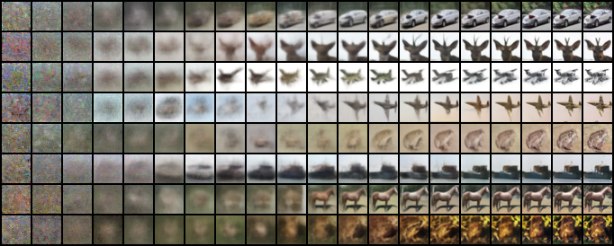

# DDPM

> Ho, Jonathan, Ajay Jain, and Pieter Abbeel. "Denoising diffusion probabilistic models." *Advances in Neural Information Processing Systems* 33 (2020): 6840-6851.


## Training

This repo uses [🤗 Accelerate](https://huggingface.co/docs/accelerate/index) library for multi-GPUs/fp16 supports. Please read the [documentation](https://huggingface.co/docs/accelerate/basic_tutorials/launch#using-accelerate-launch) for how to launch the script on different platforms.

```shell
accelerate-launch scripts/train_ddpm.py -c CONFIG [-e EXP_DIR] [--key value ...]
```

Arguments:

- `-c CONFIG`: path to the training configuration file.
- `-e EXP_DIR`: results (logs, checkpoints, tensorboard, etc.) will be saved to `EXP_DIR`. Default to `runs/exp-{current time}/`.
- `--key value`: modify configuration items in `CONFIG` via CLI.

For example, to train on CIFAR-10 with default settings:

```shell
accelerate-launch scripts/train_ddpm.py -c ./configs/ddpm_cifar10.yaml
```

To change the default variance schedule in `./configs/ddpm_cifar10.yaml` from linear to cosine:

```shell
accelerate-launch scripts/train_ddpm.py -c ./configs/ddpm_cifar10.yaml --diffusion.params.beta_schedule cosine
```


## Sampling

```shell
accelerate-launch scripts/sample_uncond.py -c CONFIG \
                                           --weights WEIGHTS \
                                           --n_samples N_SAMPLES \
                                           --save_dir SAVE_DIR \
                                           [--seed SEED] \
                                           [--var_type VAR_TYPE] \
                                           [--batch_size BATCH_SIZE] \
                                           [--respace_type RESPACE_TYPE] \
                                           [--respace_steps RESPACE_STEPS] \
                                           [--mode {sample,denoise,progressive}] \
                                           [--n_denoise N_DENOISE] \
                                           [--n_progressive N_PROGRESSIVE]
```

Basic arguments:

- `-c CONFIG`: path to the inference configuration file.
- `--weights WEIGHTS`: path to the model weights (checkpoint) file.
- `--n_samples N_SAMPLES`: number of samples.
- `--save_dir SAVE_DIR`: path to the directory where samples will be saved.
- `--mode MODE`: choose a sampling mode, the options are:
  - "sample" (default): randomly sample images
  - "denoise": sample images with visualization of its denoising process.
  - "progressive":  sample images with visualization of its progressive generation process (i.e. predicted $x_0$).

Advanced arguments:

- `--batch_size BATCH_SIZE`: Batch size on each process. Sample by batch is faster, so set it as large as possible to fully utilize your devices.
- `--respace_steps RESPACE_STEPS`: faster sampling that uses respaced timesteps.
- `--var_type VAR_TYPE`: type of variance of the reverse process.

See more details by running `python sample_ddpm.py -h`.

For example, to sample 50000 images from a pretrained CIFAR-10 model with 100 steps and "fixed_small" variance:

```shell
accelerate-launch scripts/sample_uncond.py -c ./configs/ddpm_cifar10.yaml --weights /path/to/model/weights --n_samples 50000 --save_dir ./samples/ddpm-cifar10 --respace_steps 100 --var_type fixed_small
```


## Evaluation

Sample 10K-50K images following the previous section and evaluate image quality with tools like [torch-fidelity](https://github.com/toshas/torch-fidelity), [pytorch-fid](https://github.com/mseitzer/pytorch-fid), [clean-fid](https://github.com/GaParmar/clean-fid), etc.


## Results

**FID and IS on CIFAR-10 32x32**:

All the metrics are evaluated on 50K samples using [torch-fidelity](https://torch-fidelity.readthedocs.io/en/latest/index.html) library.

<table align="center" width=100%>
  <tr>
    <th align="center">Objective</th>
    <th align="center">Type of variance</th>
    <th align="center">timesteps</th>
    <th align="center">FID ↓</th>
    <th align="center">IS ↑</th>
  </tr>
  <tr>
    <td align="center" rowspan="10">pred-eps</td>
    <td align="center" rowspan="5">fixed-large</td>
    <td align="center">1000</td>
    <td align="center"><b>3.0459</b></td>
    <td align="center"><b>9.4515 ± 0.1179</b></td>
  </tr>
  <tr>
    <td align="center">100</td>
    <td align="center">46.5454</td>
    <td align="center">8.7223 ± 0.0923</td>
  </tr>
  <tr>
    <td align="center">50</td>
    <td align="center">85.2221</td>
    <td align="center">6.3863 ± 0.0894</td>
  </tr>
  <tr>
    <td align="center">20</td>
    <td align="center">183.3468</td>
    <td align="center">2.6885 ± 0.0176</td>
  </tr>
  <tr>
    <td align="center">10</td>
    <td align="center">266.7540</td>
    <td align="center">1.5870 ± 0.0092</td>
  </tr>
  <tr>
    <td align="center" rowspan="5">fixed-small</td>
    <td align="center">1000</td>
    <td align="center">5.3727</td>
    <td align="center">9.0118 ± 0.0968</td>
  </tr>
  <tr>
    <td align="center">100</td>
    <td align="center">11.2191</td>
    <td align="center">8.6237 ± 0.0921</td>
  </tr>
  <tr>
    <td align="center">50</td>
    <td align="center">15.0471</td>
    <td align="center">8.4077 ± 0.1623</td>
  </tr>
  <tr>
    <td align="center">20</td>
    <td align="center">24.5131</td>
    <td align="center">7.9957 ± 0.1067</td>
  </tr>
  <tr>
    <td align="center">10</td>
    <td align="center">41.04793</td>
    <td align="center">7.1373 ± 0.0801</td>
  </tr>
  <tr>
    <td align="center" rowspan="2">pred-x0</td>
    <td align="center">fixed-large</td>
    <td align="center">1000</td>
    <td align="center">13.3310</td>
    <td align="center">7.7624 ± 0.0818</td>
  </tr>
  <tr>
    <td align="center">fixed-small</td>
    <td align="center">1000</td>
    <td align="center">14.3750</td>
    <td align="center">7.7426 ± 0.0759</td>
  </tr>
  <tr>
    <td align="center" rowspan="2">pred-v</td>
    <td align="center">fixed-large</td>
    <td align="center">1000</td>
    <td align="center">3.9703</td>
    <td align="center">9.0253 ± 0.1084</td>
  </tr>
  <tr>
    <td align="center">fixed-small</td>
    <td align="center">1000</td>
    <td align="center">6.6707</td>
    <td align="center">8.6282 ± 0.1107</td>
  </tr>
 </table>


**Random samples**:

<p align="center">
  
  
  
</p>


**Denoising process**:

<p align="center">
  
</p>
<p align="center">
  
</p>


**Progressive generation**:

<p align="center">
  
</p>
<p align="center">
  
</p>
